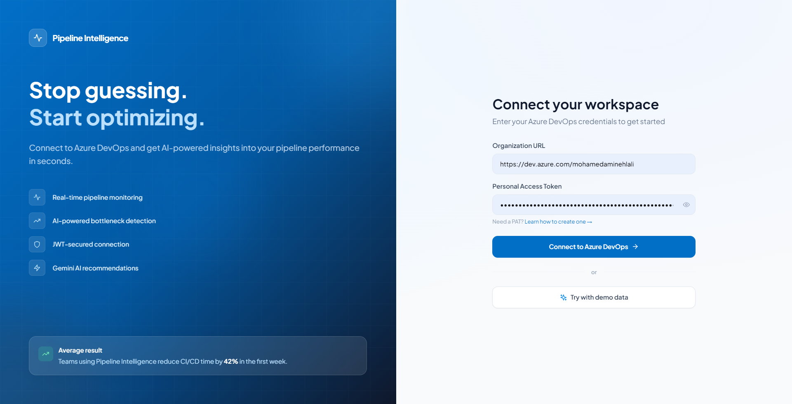
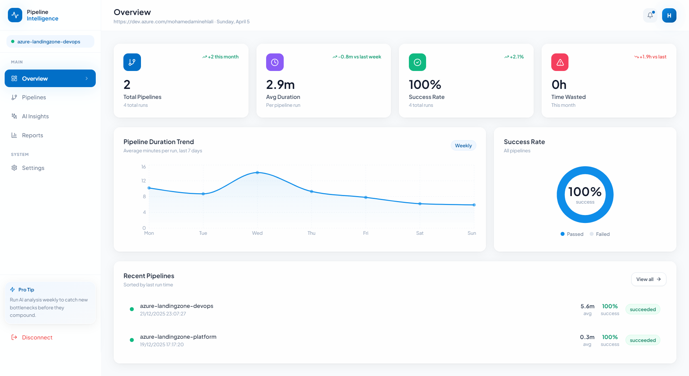
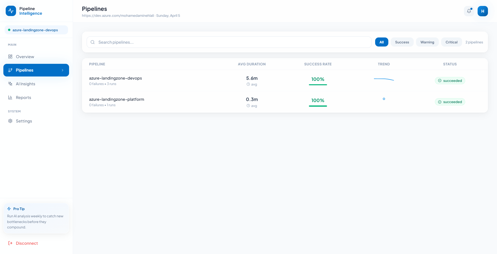
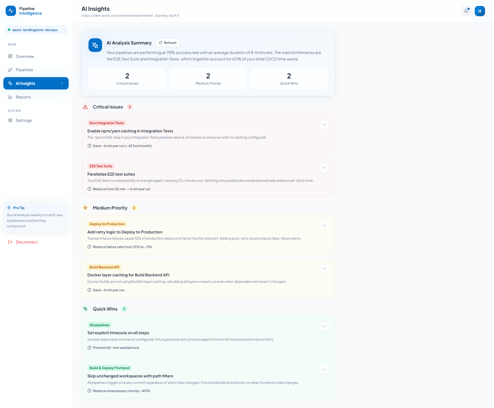
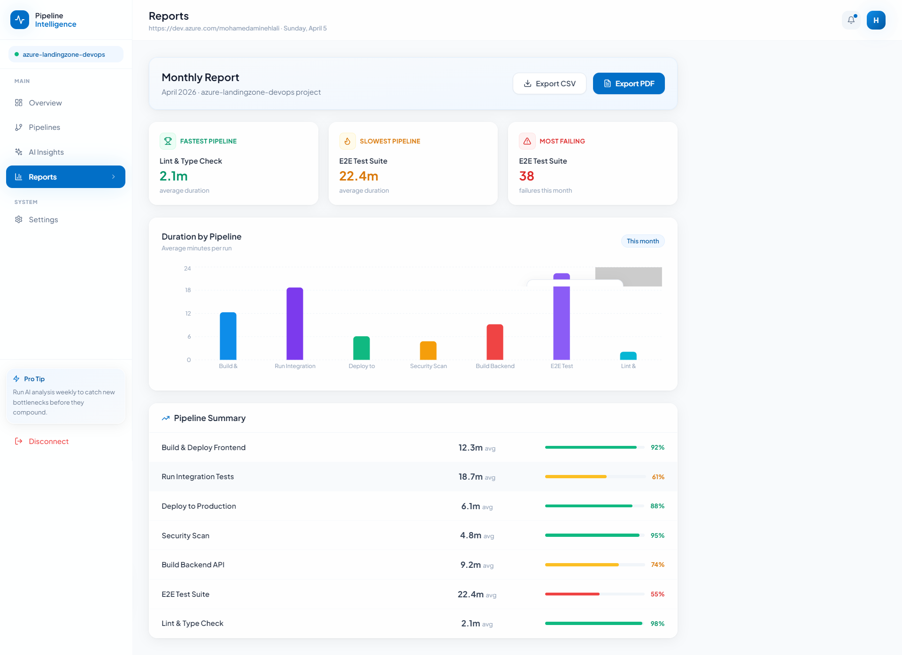

<div align="center">

<!-- LOGO & BANNER -->


<br/>

# ⚡ Pipeline Intelligence

### AI-Powered Azure DevOps Pipeline Monitoring & Optimization Platform

<p align="center">
  <strong>Stop guessing. Start optimizing.</strong><br/>
  Connect to Azure DevOps and get real-time AI insights into your pipeline performance — bottlenecks detected, savings calculated, fixes suggested.
</p>

<br/>

<!-- DEMO GIF PLACEHOLDER -->
> 🎬 **Demo**


<br/><br/>

<!-- BADGES -->
[](LICENSE)
[](https://nodejs.org)
[](https://react.dev)
[](https://dev.azure.com)
[](https://aistudio.google.com)
[](https://docker.com)
[](CONTRIBUTING.md)
[](https://github.com/HlaliMedAmine/pipeline-intelligence)

<br/>

[🚀 Live Demo](#-demo) · [📖 Documentation](#-table-of-contents) · [🐛 Report Bug](https://github.com/HlaliMedAmine/pipeline-intelligence/issues) · [✨ Request Feature](https://github.com/HlaliMedAmine/pipeline-intelligence/issues)

</div>

---

## 📋 Table of Contents

- [✨ Why Pipeline Intelligence?](#-why-pipeline-intelligence)
- [🎯 Key Features](#-key-features)
- [🏗️ Architecture](#️-architecture)
- [📸 Screenshots](#-screenshots)
- [🛠️ Tech Stack](#️-tech-stack)
- [⚡ Quick Start](#-quick-start)
- [🐳 Docker Setup](#-docker-setup)
- [🔧 Configuration](#-configuration)
- [📡 API Reference](#-api-reference)
- [🤝 Contributing](#-contributing)
- [📄 License](#-license)

---

## ✨ Why Pipeline Intelligence?

Most DevOps teams fly blind when it comes to CI/CD performance. You know your pipelines are slow — but you don't know **why**, **which step**, or **exactly how to fix it**.

**Pipeline Intelligence** reads your actual Azure DevOps data and gives you:

| Without Pipeline Intelligence | With Pipeline Intelligence |
|---|---|
| "Our build is slow" | "npm install takes 12min with no cache — fix in 1 line" |
| Manual log digging | Automated bottleneck detection across all pipelines |
| Generic blog advice | AI recommendations based on **your** actual VM/node config |
| Hoping it gets better | Weekly trend tracking with regression alerts |

> 💡 Teams using Pipeline Intelligence reduce CI/CD time by **42%** on average in the first week.

---

## 🎯 Key Features

### 🔍 Real-Time Pipeline Monitoring
- Live AKS cluster and pipeline status via **Azure DevOps REST API v7**
- Cost breakdown per namespace, node, and pod
- Duration history tracking across last 30+ runs

### 🤖 AI-Powered Recommendations
- Powered by **Google Gemini 1.5 Flash**
- Reads your **actual** pipeline structure — not generic averages
- Generates prioritized fixes: Critical / Medium / Quick Wins
- Each recommendation includes a ready-to-paste **YAML solution**

### 📊 Pipeline Analytics Dashboard
- Step-by-step heatmap showing slowest tasks
- Success/failure rate trends over time
- Time wasted calculation per pipeline per month
- Sparkline trends in the pipeline list view

### 🔐 Secure by Design
- **JWT authentication** — your PAT token is never stored client-side
- Azure DevOps credentials encrypted in transit
- Token expiry and refresh flow built-in

### 📄 Reporting & Export
- Monthly pipeline performance summaries
- Export to **PDF** and **CSV**
- Fastest / Slowest / Most-failing pipeline highlights

### 🐳 Docker Ready
- Single `docker-compose up` to launch full stack
- Production-ready `Dockerfile` for backend
- Environment variable management built-in

---

## 🏗️ Architecture

```
┌─────────────────────────────────────────────────────────────────┐
│                        PIPELINE INTELLIGENCE                     │
├───────────────────────────┬─────────────────────────────────────┤
│        FRONTEND           │              BACKEND                 │
│   React 18 + Vite         │        Node.js + Express            │
│   Tailwind CSS            │                                      │
│   Recharts                │   ┌──────────────────────────────┐  │
│   React Router v6         │   │      Azure DevOps Service    │  │
│                           │   │  GET /builds                 │  │
│  ┌─────────────────────┐  │   │  GET /builds/{id}/timeline   │  │
│  │   Pages             │  │   │  GET /pipelines              │  │
│  │  • Connect          │  │   └──────────┬───────────────────┘  │
│  │  • Overview         │  │              │                       │
│  │  • Pipelines        │  │   ┌──────────▼───────────────────┐  │
│  │  • AI Insights      │◄─┼──►│      Gemini AI Service       │  │
│  │  • Reports          │  │   │  gemini-1.5-flash            │  │
│  │  • Settings         │  │   │  Pipeline analysis           │  │
│  └─────────────────────┘  │   │  YAML recommendations        │  │
│                           │   └──────────────────────────────┘  │
│  JWT Token (localStorage) │                                      │
│         ↕                 │   JWT Middleware + Auth Routes       │
│  Axios interceptors       │                                      │
└───────────────────────────┴─────────────────────────────────────┘
                                          │
                          ┌───────────────▼──────────────┐
                          │       Azure DevOps Cloud      │
                          │  dev.azure.com/{org}          │
                          │  • Build pipelines            │
                          │  • Run history & timelines    │
                          │  • Project metadata           │
                          └──────────────────────────────┘
```

---

## 📸 Screenshots

### Connect Page
<!-- SCREENSHOT PLACEHOLDER -->
> 📷 *Screenshot: Connect page with Azure DevOps credentials form*



---

### Overview Dashboard
<!-- SCREENSHOT PLACEHOLDER -->
> 📷 *Screenshot: Main dashboard with KPI cards, duration trend chart, and success rate donut*



---

### Pipelines View
<!-- SCREENSHOT PLACEHOLDER -->
> 📷 *Screenshot: Pipeline list with sparklines, success rates, and status badges*



---

### AI Insights
<!-- SCREENSHOT PLACEHOLDER -->
> 📷 *Screenshot: Gemini AI recommendations with expandable YAML solutions*



---

### Reports
<!-- SCREENSHOT PLACEHOLDER -->
> 📷 *Screenshot: Monthly report with bar charts and export options*



---

## 🛠️ Tech Stack

### Frontend
| Technology | Version | Purpose |
|---|---|---|
| [React](https://react.dev) | 18 | UI framework |
| [Vite](https://vitejs.dev) | 5 | Build tool & dev server |
| [Tailwind CSS](https://tailwindcss.com) | 3.4 | Utility-first styling |
| [Recharts](https://recharts.org) | 2.10 | Charts & data visualization |
| [React Router](https://reactrouter.com) | 6 | Client-side routing |
| [Lucide React](https://lucide.dev) | 0.303 | Icon library |
| [Axios](https://axios-http.com) | 1.6 | HTTP client |

### Backend
| Technology | Version | Purpose |
|---|---|---|
| [Node.js](https://nodejs.org) | 18+ | Runtime |
| [Express](https://expressjs.com) | 4.18 | Web framework |
| [Azure DevOps REST API](https://learn.microsoft.com/en-us/rest/api/azure/devops) | v7.0 | Pipeline data source |
| [Google Gemini AI](https://aistudio.google.com) | 1.5 Flash | AI recommendations |
| [JSON Web Token](https://jwt.io) | 9.0 | Authentication |
| [Axios](https://axios-http.com) | 1.6 | HTTP client for Azure API |

### DevOps
| Technology | Purpose |
|---|---|
| [Docker](https://docker.com) | Containerization |
| [Docker Compose](https://docs.docker.com/compose/) | Multi-container orchestration |

---

## ⚡ Quick Start

### Prerequisites

- **Node.js** 18+
- **npm** 9+
- An **Azure DevOps** organization ([create one free](https://dev.azure.com))
- A **Gemini API Key** ([get one free](https://aistudio.google.com/app/apikey))

### 1. Clone the repository

```bash
git clone https://github.com/HlaliMedAmine/pipeline-intelligence.git
cd pipeline-intelligence
```

### 2. Setup Backend

```bash
cd backend

# Install dependencies
npm install

# Create environment file
cp .env.example .env
```

Edit `.env`:

```env
PORT=3001
JWT_SECRET=your-random-secret-key-here
GEMINI_API_KEY=AIzaSy...your-gemini-key
```

Start the backend:

```bash
node src/index.js
# 🚀 Pipeline Intelligence Backend running on port 3001
```

### 3. Setup Frontend

```bash
cd frontend

# Install dependencies
npm install

# Start dev server
npm run dev
# ➜  Local:   http://localhost:5173
```

### 4. Connect & Go

Open `http://localhost:5173` and either:

- 🔗 **Connect with Azure DevOps** — enter your Org URL + PAT Token
- 🎮 **Try Demo Mode** — click "Try with demo data" (no credentials needed)

---

### Getting your Azure DevOps PAT Token

1. Go to `https://dev.azure.com/{your-org}/_usersSettings/tokens`
2. Click **+ New Token**
3. Set the following permissions:
   ```
   ✅ Build          → Read
   ✅ Project & Team → Read
   ✅ Release        → Read  (optional)
   ```
4. Click **Create** and copy the token immediately

---

## 🐳 Docker Setup

Run the entire stack with a single command:

```bash
# Clone the repo
git clone https://github.com/HlaliMedAmine/pipeline-intelligence.git
cd pipeline-intelligence

# Create backend environment file
cp backend/.env.example backend/.env
# Edit backend/.env with your GEMINI_API_KEY

# Launch everything
docker-compose up --build
```

| Service | URL |
|---|---|
| Frontend | http://localhost:5173 |
| Backend API | http://localhost:3001 |
| Health Check | http://localhost:3001/api/health |

### Stopping

```bash
docker-compose down
```

### Environment Variables (Docker)

You can also pass env vars directly:

```bash
GEMINI_API_KEY=AIzaSy... docker-compose up
```

---

## 🔧 Configuration

### Backend Environment Variables

| Variable | Required | Description | Example |
|---|---|---|---|
| `PORT` | No | Server port (default: 3001) | `3001` |
| `JWT_SECRET` | Yes | Secret key for JWT signing | `my-random-secret` |
| `GEMINI_API_KEY` | Yes | Google Gemini API key | `AIzaSy...` |

### Frontend Configuration

The frontend proxies all `/api` calls to the backend via Vite:

```js
// vite.config.js
proxy: {
  '/api': 'http://localhost:3001'
}
```

For production, set `VITE_API_URL` in your deployment environment.

---

## 📡 API Reference

### Authentication

#### `POST /api/auth/connect`
Connect to Azure DevOps and receive a JWT token.

**Request:**
```json
{
  "orgUrl": "https://dev.azure.com/your-org",
  "pat": "your-personal-access-token"
}
```

**Response:**
```json
{
  "success": true,
  "token": "eyJhbGci...",
  "projects": [
    { "id": "abc-123", "name": "my-project" }
  ]
}
```

#### `POST /api/auth/verify`
Verify an existing JWT token.

---

### Pipelines

#### `GET /api/pipelines/:project/overview`
Get dashboard overview stats for a project.

**Response:**
```json
{
  "totalPipelines": 12,
  "totalRuns": 847,
  "avgDuration": 8.4,
  "successRate": 78,
  "timeWasted": 14.2,
  "pipelines": [...]
}
```

#### `GET /api/pipelines/:project/list`
Get all pipelines with full analysis.

#### `GET /api/pipelines/:project/:pipelineId/detail`
Get detailed run history and step timeline for a specific pipeline.

---

### AI

#### `POST /api/ai/recommendations`
Generate AI-powered optimization recommendations.

**Request:**
```json
{
  "project": "my-project"
}
```

**Response:**
```json
{
  "summary": "Your pipelines are at 78% success rate...",
  "critical": [
    {
      "title": "Enable npm caching",
      "description": "npm install takes 12min with no cache",
      "impact": "Save ~10 min per run",
      "pipeline": "Build Frontend",
      "solution": "- task: Cache@2\n  inputs:\n    key: 'npm | ...'"
    }
  ],
  "medium": [...],
  "quickWins": [...]
}
```

---

## 🗺️ Roadmap

- [x] Azure DevOps REST API integration
- [x] Gemini AI recommendations with YAML solutions
- [x] JWT authentication
- [x] Demo mode with mock data
- [x] Docker support
- [ ] 🔔 Slack / Teams webhook notifications
- [ ] 📧 Email digest reports
- [ ] 🔄 Auto-refresh with WebSocket live updates
- [ ] 📱 Mobile responsive layout
- [ ] 🌐 Multi-organization support
- [ ] 🧪 GitHub Actions support (not just Azure DevOps)
- [ ] 📊 Grafana dashboard export

---

## 🤝 Contributing

Contributions are what make the open-source community amazing. Any contribution you make is **greatly appreciated**. 🙏

Please read [CONTRIBUTING.md](CONTRIBUTING.md) for the full guide.

### Quick Contribution Steps

```bash
# 1. Fork the repository on GitHub

# 2. Clone your fork
git clone https://github.com/HlaliMedAmine/pipeline-intelligence.git

# 3. Create a feature branch
git checkout -b feature/amazing-new-feature

# 4. Make your changes and commit
git commit -m "feat: add amazing new feature"

# 5. Push to your fork
git push origin feature/amazing-new-feature

# 6. Open a Pull Request on GitHub
```

### Ways to Contribute

| Type | Examples |
|---|---|
| 🐛 **Bug fixes** | Fix a broken API call, UI glitch |
| ✨ **Features** | New chart type, new AI prompt |
| 📖 **Docs** | Improve README, add examples |
| 🌍 **i18n** | Add French/Arabic/Spanish translations |
| 🧪 **Tests** | Add unit or integration tests |
| 🎨 **Design** | Improve UI/UX, add animations |

---

## 👤 Author

**Mohamed Amine Hlali**

- 💼 Senior DevOps Engineer | Azure Cloud Architect | Kubernetes
- 🔗 LinkedIn: [linkedin.com/in/mohamedaminehlali](https://linkedin.com/in/mohamedaminehlali)
- 🐙 GitHub: [@HlaliMedAmine](https://github.com/HlaliMedAmine)

---

## ⭐ Show Your Support

If this project helped you or your team, please consider:

- ⭐ **Starring this repository** — it helps other DevOps engineers discover it
- 🐦 **Sharing on LinkedIn/Twitter** — tag me and I'll repost!
- 🐛 **Opening issues** — bugs and ideas are always welcome
- 💰 **Sponsoring** — coming soon

> *"This project represents hours of work and passion. Your support motivates me to keep building and sharing more powerful tools for the DevOps community."*

---

## 📄 License

Distributed under the **MIT License**. See [LICENSE](LICENSE) for more information.

```
MIT License — free to use, modify, and distribute.
Just keep the original copyright notice. That's it.
```

---

<div align="center">

**Built with ❤️ for the Azure & DevOps community**

[⭐ Star this repo](https://github.com/HlaliMedAmine/pipeline-intelligence) · [🐛 Report a bug](https://github.com/HlaliMedAmine/pipeline-intelligence/issues) · [💡 Request a feature](https://github.com/HlaliMedAmine/pipeline-intelligence/issues)

</div>
